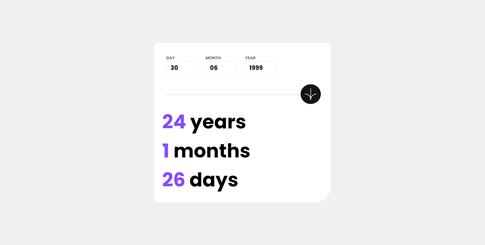
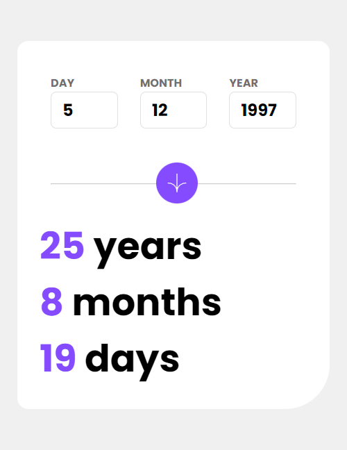

# Frontend Mentor - Age calculator app solution

This is a solution to the [Age calculator app challenge on Frontend Mentor](https://www.frontendmentor.io/challenges/age-calculator-app-dF9DFFpj-Q).

## Table of contents

- [Overview](#overview)
  - [The challenge](#the-challenge)
  - [Screenshot](#screenshot)
  - [Links](#links)
- [My process](#my-process)
  - [Built with](#built-with)
  - [What I learned](#what-i-learned)
  - [Continued development](#continued-development)
  - [Useful resources](#useful-resources)
- [Author](#author)

## Overview

### The challenge

Users should be able to:

- View an age in years, months, and days after submitting a valid date through the form
- Receive validation errors if:
  - Any field is empty when the form is submitted
  - The day number is not between 1-31
  - The month number is not between 1-12
  - The year is in the future
  - The date is invalid e.g. 31/04/1991 (there are 30 days in April)
- View the optimal layout for the interface depending on their device's screen size
- See hover and focus states for all interactive elements on the page
- **Bonus**: See the age numbers animate to their final number when the form is submitted

### Screenshot

### Links
- Live Site URL:[https://kmarsic.github.io/age-calculator/](https://kmarsic.github.io/age-calculator/)

## My process

### Built with

- Semantic HTML5 markup
- CSS custom properties
- Flexbox
- Mobile-first workflow
- Vanilla JS

### What I learned

This project helped me understand ternary operators in JS and also how sometimes they might not be the best option.  

### Continued development

I really liked this project and I plan to do more projects like this one, with the goal of improving my skills and becoming more confident in my code.

### Useful resources

- [Hyperplexed](https://www.youtube.com/watch?v=W5oawMJaXbU) - I used this code as a basis for my animation, altough altering it just a bit to fit my purposes, converting it from a event listener to a function.

## Author
Frontend Mentor - [https://www.frontendmentor.io/profile/kmarsic](https://www.frontendmentor.io/profile/kmarsic)

LinkedIn - [https://www.linkedin.com/in/kmarsic/](https://www.linkedin.com/in/kristijan-mar%C5%A1i%C4%87-300447277/))
